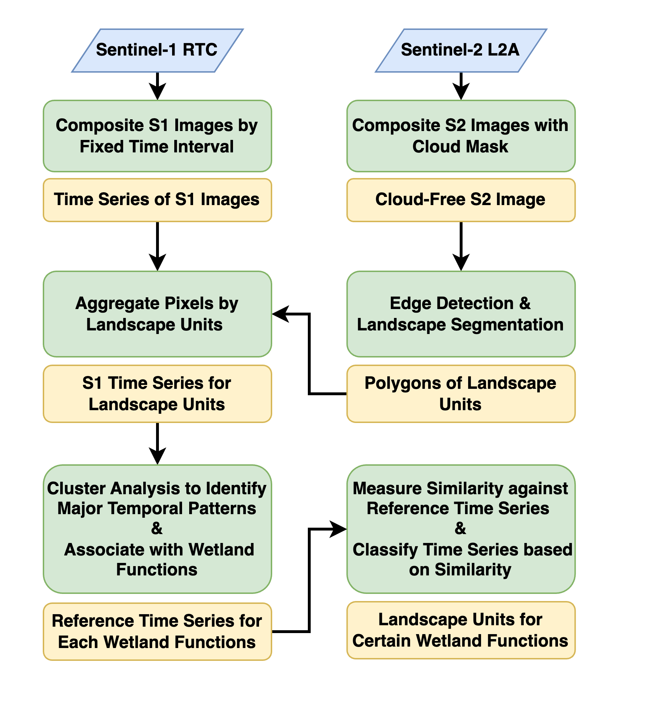

# Wetland Function Assessment Tutorial

## Problem Statement:

For wetland ecosystems, the location and persistence of surface water (inland and coastal) is a key driver 
of biological diversity and ecosystems services. Restoring of natural wetland inundation function is often 
an important feature of wetland restoration because the hydrological regime drives the nutrient fluxes, 
water quality, and habitat suitability for plant and animal species and other biodiversity. For example, 
enabling reconnection of wetlands within a floodplain and restoring wetland inundation functions can 
be a key indicator of wetland restoration.

The biological effects of irregular inundation is recognized as a high-priority remote sensing biodiversity 
product, related to the “ecosystem disturbance and habitat structure” remote sensing enabled essential 
biodiversity variables (RS-EBVs) (Skidmore et al. 2021).
EO time series have a proven capability in the detection of surface water location and vegetation 
inundation seasonality. Several initiatives aimed to use multi-spectral and radar time series such as the Joint 
Research Centre's (JRC) global surface water permanence dataset based on the Landsat time series (Pekel 
et al. 2016) and the ESA financed WorldWater project1 provide valuable information but are limited to the 
detection of surface water. Ecosystem restoration practitioners require tools to assess complex wetland ecosystems. 
However, challenges include working with large volumes of EO data, handling EO data time series, the complexity of
wetland structure, and methods to assess wetland restoration, i.e., using reference sites or reference time periods.
Another factor is the inter-annual variability of climate and short to long-term responses of wetlands to restoration processes 
and climate variability.

## Tutorial Objective:

The objective of the PEOPLE-ER Wetland and Wetness Trends tutorial is to provide and demonstrate a flexible, and powerful 
set of EO data analytics tools to support wetland ER assessment. The tutorial demonstrates methods for high-resolution
satellite EO data time series analysis to enable the monitoring and comparison of surface water 
dynamics and wetness trends in natural to heavily modified wetland ecosystems.

With recent innovation in cloud computing and the availability of long-term Synthetic Aperture Radar 
(SAR) EO datasets at high temporal and spatial resolution, the technical objective is to develop analysis 
tools in such a way that it is not tied to a singular EO exploitation platform, but instead can be used 
on a variety of platforms.

## Tutorial Workflow:

This workflow will be split into 5 notebooks that will guide you through the tutorial:

- 01_inspect_S1_time_series.ipynb
- 02_landscape_segmentation.ipynb
- 03_compile_time_series.ipynb
- 04_cluster_analysis.ipynb
- 05_calculate_dtw.ipynb

Each one of these notebooks will touch on key steps of the PEOPLE-ER workflow to Assess Wetland Function in natural to heavily modified wetland ecosystems.

## Workflow Diagram

## Demonstration Area

The area used for the demonstration of this workflow is the An-Giang province of Vietnam, a highly modified wetland landscape, that has recently seen efforts to restore natural flood dynamics.

## Acknowledgements

This tutorial was developed within the Pioneer Earth Observation apPlications for the Environment Ecosystem 
Restoration (PEOPLE-ER) project financed by the European Space Agency (ESA). Members of the PEOPLE-ER consortium include:

## How to Cite

When using this tool in your work we ask that you please cite the Spectral_Recovery tool as follows:

"Spectral Recovery method developed in the PEOPLE-ER Project, managed by Hatfield Consultants, and financed by the European Space Agency."

## License

Copyright 2023 Hatfield Consultants LLP

Licensed under the Apache License, Version 2.0 (the "License");
you may not use this file except in compliance with the License.
You may obtain a copy of the License at

    http://www.apache.org/licenses/LICENSE-2.0

Unless required by applicable law or agreed to in writing, software
distributed under the License is distributed on an "AS IS" BASIS,
WITHOUT WARRANTIES OR CONDITIONS OF ANY KIND, either express or implied.
See the License for the specific language governing permissions and
limitations under the License.