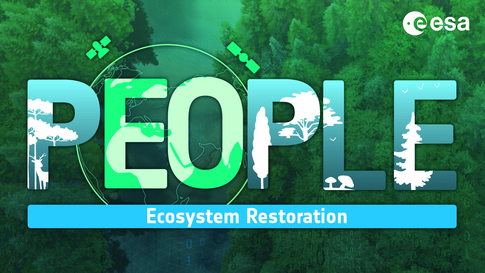
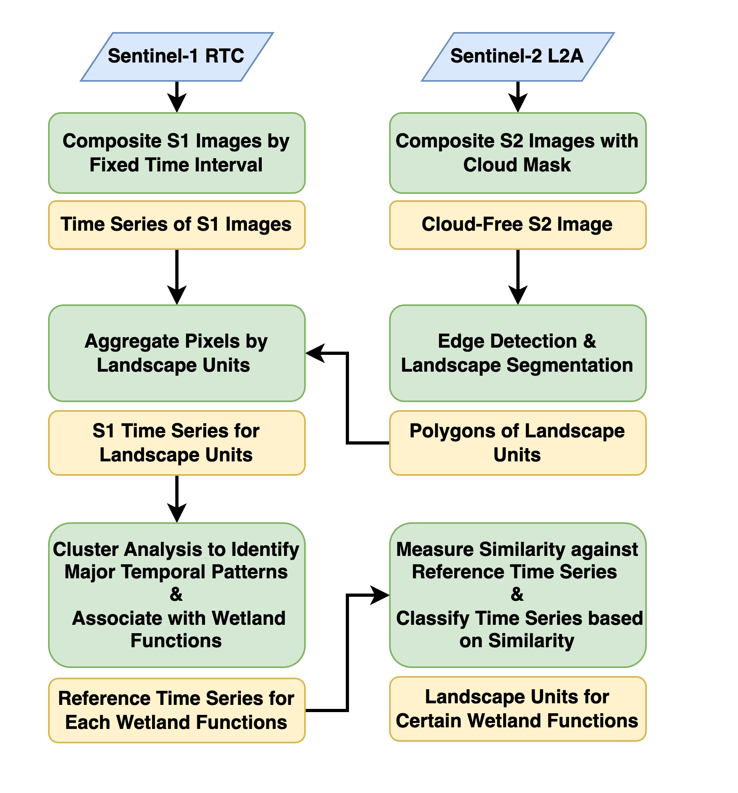

# Welcome to the PEOPLE-ER Wetland Function Assessment Tutorial!

{align=center}

## Problem Statement:

For wetland ecosystems, the location and persistence of surface water (inland and coastal) is a key driver
of biological diversity and ecosystems services. Restoring of natural wetland inundation function is often
an important feature of wetland restoration because the hydrological regime drives the nutrient fluxes,
water quality, and habitat suitability for plant and animal species and other biodiversity. For example,
enabling reconnection of wetlands within a floodplain and restoring wetland inundation functions can
be a key indicator of wetland restoration.

The biological effects of irregular inundation is recognized as a high-priority remote sensing biodiversity
product, related to the “ecosystem disturbance and habitat structure” remote sensing enabled essential
biodiversity variables (RS-EBVs) (Skidmore et al. 2021).
EO time series have a proven capability in the detection of surface water location and vegetation
inundation seasonality. Several initiatives aimed to use multi-spectral and radar time series such as the Joint
Research Centre's (JRC) global surface water permanence dataset based on the Landsat time series (Pekel
et al. 2016) and the ESA financed WorldWater project1 provide valuable information but are limited to the
detection of surface water. Ecosystem restoration practitioners require tools to assess complex wetland ecosystems.
However, challenges include working with large volumes of EO data, handling EO data time series, the complexity of
wetland structure, and methods to assess wetland restoration, i.e., using reference sites or reference time periods.
Another factor is the inter-annual variability of climate and short to long-term responses of wetlands to restoration processes
and climate variability.

## Tutorial Objective:

The objective of the PEOPLE-ER Wetland and Wetness Trends tutorial is to provide and demonstrate a flexible, and powerful
set of EO data analytics tools to support wetland ER assessment. The tutorial demonstrates methods for high-resolution
satellite EO data time series analysis to enable the monitoring and comparison of surface water
dynamics and wetness trends in natural to heavily modified wetland ecosystems.

With recent innovation in cloud computing and the availability of long-term Synthetic Aperture Radar
(SAR) EO datasets at high temporal and spatial resolution, the technical objective is to develop analysis
tools in such a way that it is not tied to a singular EO exploitation platform, but instead can be used
on a variety of platforms.

## Tutorial Workflow:

This workflow will be split into 5 notebooks that will guide you through the tutorial:

- 1) Inspect S1 Time-Series for an Area of Interest
- 2) Segment Landscape based on S2 Composites
- 3) Compile Time Series by Units of Analysis
- 4) Clustering and Reference Extraction
- 5) Comparing similarities between Time Series

Each one of these notebooks will touch on key steps of the PEOPLE-ER workflow to Assess Wetland Function in natural to heavily modified wetland ecosystems.

## Workflow Diagram

## Demonstration Area

The area used for the demonstration of this workflow is the An-Giang province of Vietnam, a highly modified wetland landscape, that has recently seen efforts to restore natural flood dynamics.

## Acknowledgements

This tutorial was developed within the Pioneer Earth Observation apPlications for the Environment Ecosystem
Restoration (PEOPLE-ER) project financed by the European Space Agency (ESA). Members of the PEOPLE-ER consortium include:

{align=center}

{align=center}

{align=center}

{align=center}

{align=center}